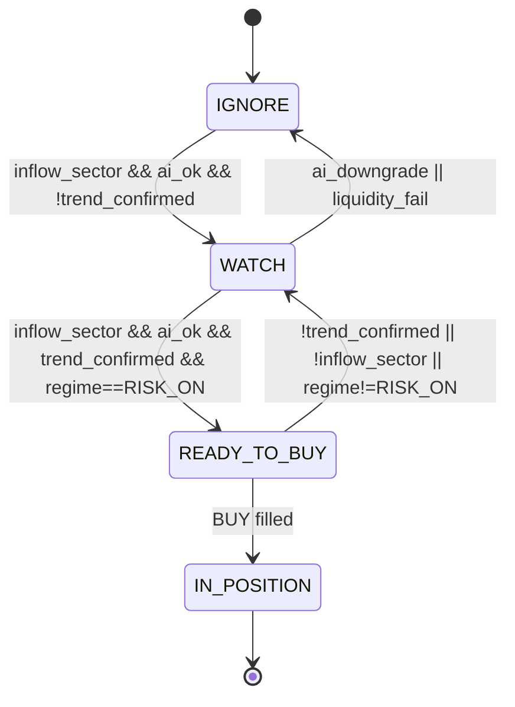
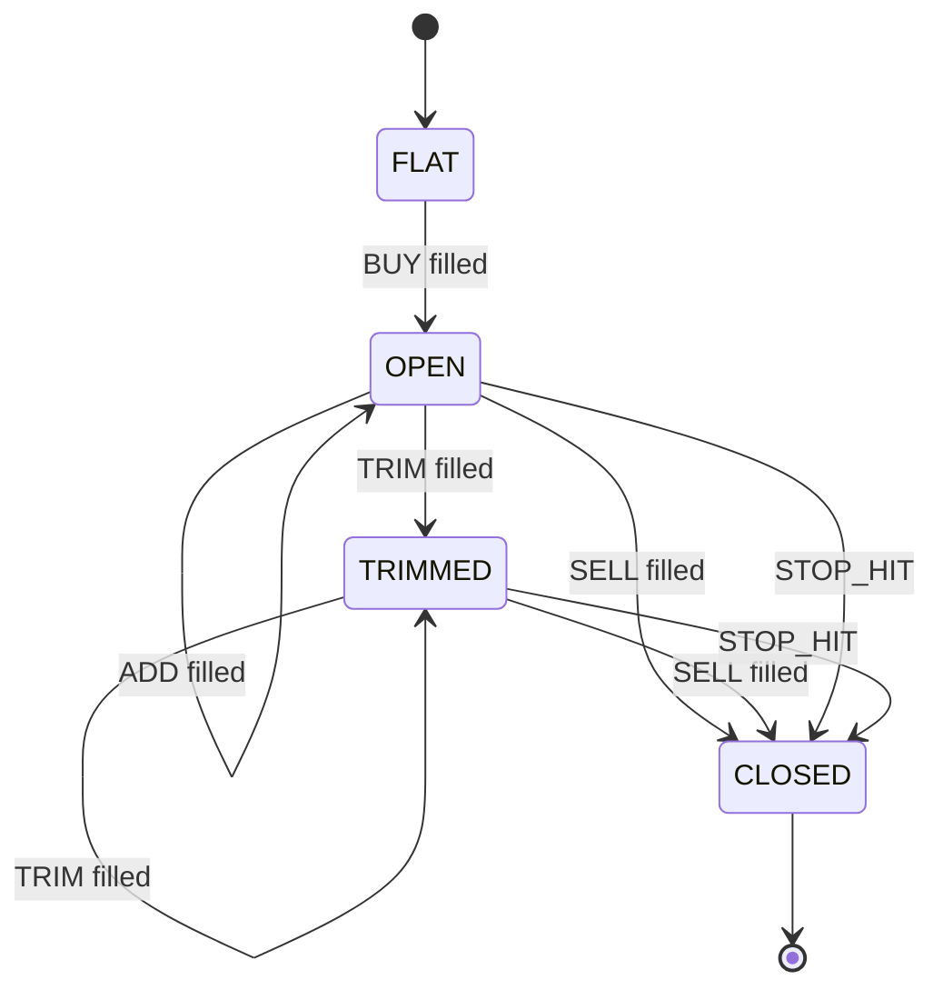
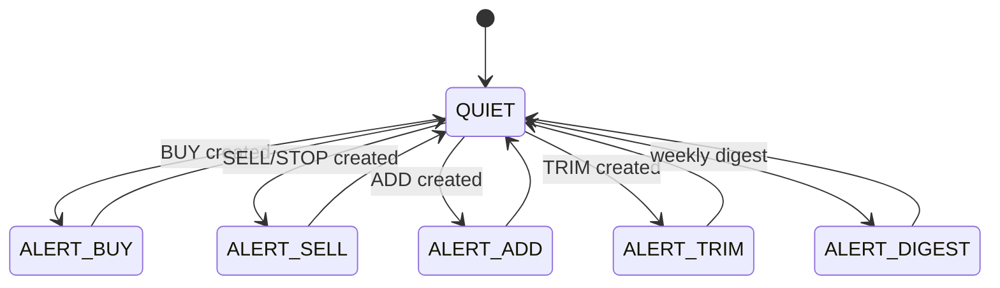
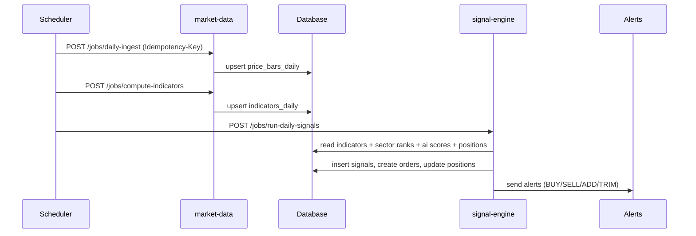
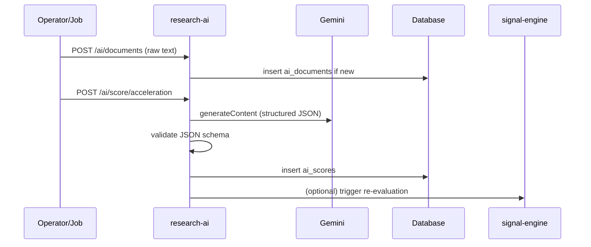

# AI Trading Signal Engine (Paper + Alerts) — Full Design Spec (README)

This README is the **single source of truth** for the system design: **API contracts**, **DB schema contracts**, **state machines**, and **end-to-end diagrams**.
No live trading in v1. The system produces **paper trades + alerts** only.

> Strategy funnel: **Sector Flow (WHERE) → Gemini Acceleration (WHAT) → Trend Confirmation (WHEN) → Risk Engine (HOW MUCH)**  
> AI interprets text only; trade decisions remain deterministic and rule-based.

Tech stack: use typescript, bazel build system, knex, expressJS and typescript.

---

## Table of Contents
1. [Goals & Scope](#goals--scope)  
2. [High-Level Architecture](#high-level-architecture)  
3. [Core Algorithms](#core-algorithms)  
4. [Data Model (DB Schema)](#data-model-db-schema)  
5. [Gemini AI Integration](#gemini-ai-integration)  
6. [Decision Engine Rules](#decision-engine-rules)  
7. [Risk Engine (Shares)](#risk-engine-shares)  
8. [State Machines](#state-machines)  
9. [API Design](#api-design)  
10. [Signal Payload Schema](#signal-payload-schema)  
11. [Scheduling & Triggers](#scheduling--triggers)  
12. [Idempotency & Concurrency](#idempotency--concurrency)  
13. [Alerts](#alerts)  
14. [Observability](#observability)  
15. [Security & Safety](#security--safety)  
16. [Appendix: Diagrams](#appendix-diagrams)

---

## Goals & Scope

### Goals
- Maintain **sector watchlists** and sector ETF mapping.
- Daily ingest OHLCV, compute indicators (EMA/ATR/RS/Volume z).
- Weekly sector ranking (flow proxy) → choose top inflow sectors.
- Event-driven **Gemini** scoring of earnings/news → structured “acceleration” output.
- Deterministic evaluation emits **BUY/WATCH/SELL/ADD/TRIM** signals.
- BUY signals include **entry, stop, shares** sized by **1% risk per trade**.
- Paper portfolio tracking (positions, stops, PnL).
- Alerts on **state transitions** + weekly digest.

### Non-Goals (v1)
- No broker execution.
- No intraday HFT / sub-minute signals.
- No “predictive” ML price forecasting.

---

## High-Level Architecture

Services (can start as one service, but contracts assume separation):

- **market-data-service**
  - `daily-ingest` OHLCV
  - compute indicators
  - compute weekly sector metrics/ranks

- **research-ai-service**
  - ingest docs (transcripts/news)
  - call Gemini with structured output
  - cache results in DB (hash-based)

- **signal-engine-service**
  - evaluate gates
  - manage paper portfolio state
  - create signals and alerts
  - weekly digest generation

### Data Flow Diagram
```text
Market Data Provider (OHLCV) ──daily──> market-data-service ──> DB
                                               │
                                               │ indicators + sector ranks
                                               ▼
                                            signal-engine-service ──> Alerts + DB (signals/portfolio)
                                               ▲
                                               │ AI scores (event-driven)
Gemini API <── research-ai-service <── docs ────┘
```

---

## Core Algorithms

### Market Regime (SPY)
Compute on daily bars:

```
spy_above_50  := close(SPY) > ema50(SPY)
spy_above_200 := close(SPY) > ema200(SPY)

regime =
  if spy_above_50 && spy_above_200 => RISK_ON
  else if !spy_above_200          => RISK_OFF
  else                               NEUTRAL
```

**Default policy:** New BUYs only in **RISK_ON**.

### Sector Flow Ranking (Weekly)
For each sector ETF (e.g., SMH/CIBR/IGV):
- `etf_5d_return`
- `bench_5d_return` (QQQ or SPY)
- `rel_strength_5d = etf_5d_return - bench_5d_return`
- `breadth_above_ema21 = % of sector members with close > ema21`
- `etf_dollar_vol_z = z-score of (close*volume)`

Rank sectors descending by a composite (example):
```
score = w1*rel_strength_5d + w2*breadth_above_ema21 + w3*etf_dollar_vol_z
rank  = 1..N where 1 is best
```
**Inflow sectors:** top `inflow_sector_top_n` (default 2).

### Trend Confirmation (Institutional Accumulation)
All conditions required:
```
trend_confirmed :=
  close > ema21 &&
  ema21 > ema50 &&
  rs_slope_10d > 0 &&
  (volume_z_today >= 1 OR max(volume_z in last 5 sessions) >= 1)
```

---

## Data Model (DB Schema)

> Schemas below are **contracts**. Migrations must implement these fields and indexes.

### 1) Universe & Sector Mapping

#### `sectors`
| Field | Type | Notes |
|------|------|------|
| id | string/uuid | PK |
| name | string | unique (e.g., "Semis") |
| benchmark_etf | string | e.g., "SMH" |
| enabled | boolean | |
| created_at | timestamp | |

#### `sector_members`
Primary key: `(sector_id, symbol)`

| Field | Type | Notes |
|------|------|------|
| sector_id | FK | sectors.id |
| symbol | string | ticker |
| source | enum | manual \| etf_holdings \| classifier |
| enabled | boolean | |
| created_at | timestamp | |

#### `universe`
| Field | Type | Notes |
|------|------|------|
| symbol | string | PK |
| type | enum | stock \| etf |
| enabled | boolean | |
| meta_json | json | optional |
| created_at | timestamp | |

---

### 2) Prices & Indicators

#### `price_bars_daily`
Unique: `(symbol, date)`

| Field | Type |
|------|------|
| symbol | string |
| date | date |
| open | decimal |
| high | decimal |
| low | decimal |
| close | decimal |
| volume | bigint |

#### `indicators_daily`
Unique: `(symbol, date)`

| Field | Type | Notes |
|------|------|------|
| symbol | string | |
| date | date | |
| ema21 | decimal | |
| ema50 | decimal | |
| ema200 | decimal | |
| atr_pct | decimal | ATR/close |
| rs_vs_spy | decimal | close(symbol)/close(SPY) |
| rs_slope_10d | decimal | regression slope |
| volume_z | decimal | z-score vs 60d |
| dollar_vol | decimal | close*volume |

Indexes recommended:
- `(symbol, date desc)`
- `(date)`

---

### 3) Sector Metrics (Weekly)

#### `sector_metrics_weekly`
Unique: `(sector_id, week_end_date)`

| Field | Type | Notes |
|------|------|------|
| sector_id | FK | sectors.id |
| week_end_date | date | last trading day |
| etf_symbol | string | copy of sectors.benchmark_etf |
| bench_symbol | string | QQQ or SPY |
| etf_5d_return | decimal | |
| bench_5d_return | decimal | |
| rel_strength_5d | decimal | |
| etf_dollar_vol_z | decimal | proxy |
| breadth_above_ema21 | decimal | 0..1 |
| rank | int | 1=best |

---

### 4) AI Documents & Scores (Gemini Cache)

#### `ai_documents`
| Field | Type | Notes |
|------|------|------|
| id | string/uuid | PK |
| symbol | string | |
| doc_type | enum | earnings \| news_batch \| manual |
| published_at | timestamp | |
| raw_text_hash | string | sha256 |
| raw_text | text | |
| source_meta_json | json | title/url/source |
| created_at | timestamp | |

Indexes:
- `(symbol, doc_type, published_at desc)`
- `(raw_text_hash)` (unique recommended)

#### `ai_scores`
| Field | Type | Notes |
|------|------|------|
| id | string/uuid | PK |
| ai_document_id | FK | ai_documents.id |
| symbol | string | |
| score_type | enum | acceleration |
| json_result | json | full structured output |
| growth_phase | string | extracted for indexing |
| conviction | int | |
| hype_risk | string | |
| created_at | timestamp | |

Indexes:
- `(symbol, created_at desc)`
- `(ai_document_id)`

---

### 5) Signals & Paper Portfolio

#### `signals`
| Field | Type | Notes |
|------|------|------|
| id | string/uuid | PK |
| symbol | string | |
| signal_type | enum | BUY \| WATCH \| SELL \| ADD \| TRIM |
| reason_json | json | full payload (see schema) |
| confidence | int | optional 0-100 |
| created_at | timestamp | |
| sent_at | timestamp | nullable |

Index:
- `(created_at desc)`
- `(symbol, created_at desc)`

#### `paper_positions`
| Field | Type |
|------|------|
| symbol | string PK |
| state | enum(open, closed) |
| shares | int |
| avg_entry | decimal |
| stop_price | decimal |
| opened_at | timestamp |
| closed_at | timestamp nullable |
| last_mark_price | decimal nullable |
| pnl_json | json nullable |

#### `paper_orders`
| Field | Type |
|------|------|
| id | string/uuid PK |
| symbol | string |
| side | enum(buy, sell) |
| order_type | enum(market) |
| shares | int |
| requested_fill_rule | enum(close, next_open) |
| requested_price | decimal nullable |
| filled_price | decimal nullable |
| status | enum(created, filled, cancelled) |
| created_at | timestamp |
| filled_at | timestamp nullable |

---

### 6) Portfolio Settings

#### `portfolio_settings` (single row)
| Field | Type | Default |
|------|------|------|
| equity_usd | decimal | required |
| risk_per_trade_pct | decimal | 0.01 |
| max_position_pct | decimal | 0.20 |
| entry_fill_rule | enum | close |
| stop_rule | enum | pct_12 |
| inflow_sector_top_n | int | 2 |
| require_ai_for_buy | bool | true |
| add_rule_enabled | bool | true |
| trim_rule_enabled | bool | true |
| updated_at | timestamp | |

---

## Gemini AI Integration

Gemini is used ONLY to convert unstructured docs into structured data used by deterministic rules.

### Triggering Gemini
Call Gemini when:
- new earnings transcript ingested
- new news batch ingested
- optional “shock” trigger (gap > 8% OR volume_z > 2) to request interpretation

### Caching
- `raw_text_hash = sha256(raw_text)`
- If a score already exists for `(raw_text_hash, score_type)`, return cached result unless `force=true`.

### Gemini Output (AccelerationScore JSON Schema)
Gemini must return JSON matching:

```json
{
  "growth_phase": "decelerating|stable|early_acceleration|strong_acceleration",
  "conviction": 0,
  "hype_risk": "low|medium|high",
  "demand_inflection_evidence": ["string"],
  "guidance_signal": "upward_bias|neutral|downward_bias",
  "key_risks": ["string"],
  "what_changes_mind": ["string"]
}
```

Validation rules:
- `conviction` must be integer 0–100
- Arrays must be arrays of strings (empty allowed)
- Reject invalid JSON / invalid enum values

Model suggestion (configurable):
- `gemini-2.5-flash` for speed/cost
- `gemini-2.5-pro` for higher quality when needed

---

## Decision Engine Rules

### BUY (default)
BUY if all true:
1. `regime == RISK_ON`
2. `sector.rank <= inflow_sector_top_n`
3. `trend_confirmed == true`
4. AI gate passes (if require_ai_for_buy):
   - `growth_phase ∈ {early_acceleration, strong_acceleration}`
   - `conviction >= 75`
   - optional: `hype_risk != high`

If AI score missing and `require_ai_for_buy=true` → emit **WATCH**, not BUY.

### WATCH
WATCH when:
- in inflow sector AND AI gate passes
- but trend not confirmed OR regime not RISK_ON

### SELL
SELL when any:
- stop breached (paper stop)
- close < EMA21 for 3 consecutive sessions
- new AI score arrives with `conviction < 60` or `growth_phase == decelerating`
- optional: regime becomes RISK_OFF AND stock closes below EMA50

### TRIM (optional)
TRIM when:
- +25% from entry within 10 trading days → sell 50% shares

### ADD (optional pyramiding)
ADD when:
- price >= entry * 1.05
- still above EMA21
- regime RISK_ON and sector still inflow
- position after add <= max_position_pct

---

## Risk Engine (Shares)

Configuration:
- `risk_per_trade_pct = 0.01`
- `max_position_pct = 0.20`
- `stop_rule` default `pct_12`

### Stop Rules
- `pct_12`: `stop_price = entry_price * 0.88`
- `ema21_3close`: SELL trigger based on 3 closes below EMA21 (used more as exit than initial stop)
- `ema21_minus_atr`: `stop_price = ema21 - k*ATR` (k configurable; start 1.5)

### Share Calculation
```
risk_dollars = equity_usd * risk_per_trade_pct
risk_per_share = entry_price - stop_price
shares_risk = floor(risk_dollars / risk_per_share)

max_position_dollars = equity_usd * max_position_pct
shares_cap = floor(max_position_dollars / entry_price)

shares = min(shares_risk, shares_cap)
```
Reject trade if:
- `risk_per_share <= 0` or `shares < 1`

---

## State Machines

### Candidate State Machine (Symbol-level)


### Paper Position State Machine


### Alert Emission (Spam Control)


---

## API Design

### Conventions
- All job endpoints require `Idempotency-Key` header.
- Responses use `{ ok, data, meta }`.
- Use `dryRun=true` to compute without writing.

Common errors:
- `400` invalid request
- `409` duplicate idempotency key already processed
- `500` internal error

---

### market-data-service

#### POST `/api/jobs/daily-ingest`
Fetch OHLCV and upsert into `price_bars_daily`.

Request:
```json
{
  "asOfDate": "2026-02-14",
  "symbols": ["SPY","QQQ","SMH"],
  "force": false
}
```

Response:
```json
{
  "ok": true,
  "data": {
    "asOfDate": "2026-02-14",
    "symbolsProcessed": 312,
    "barsUpserted": 312
  }
}
```

#### POST `/api/jobs/compute-indicators`
Compute indicators and upsert into `indicators_daily`.

Request:
```json
{
  "asOfDate": "2026-02-14",
  "symbols": ["SPY","QQQ","SMH"],
  "lookbackDays": 260
}
```

Response:
```json
{
  "ok": true,
  "data": {
    "asOfDate": "2026-02-14",
    "indicatorsUpserted": 312
  }
}
```

#### POST `/api/jobs/weekly-sector-rank`
Compute `sector_metrics_weekly` and ranks.

Request:
```json
{
  "weekEndDate": "2026-02-14",
  "benchmark": "QQQ",
  "topN": 2
}
```

Response:
```json
{
  "ok": true,
  "data": {
    "weekEndDate": "2026-02-14",
    "sectorsRanked": 8,
    "topSectors": [
      { "sector": "Semis", "rank": 1, "rel_strength_5d": 0.023 },
      { "sector": "Cyber", "rank": 2, "rel_strength_5d": 0.011 }
    ]
  }
}
```

---

### research-ai-service (Gemini)

#### POST `/api/ai/documents`
Ingest a document for scoring.

Request:
```json
{
  "symbol": "NVDA",
  "docType": "earnings",
  "publishedAt": "2026-02-13T00:00:00Z",
  "rawText": "....",
  "sourceMeta": {
    "source": "manual_upload",
    "url": null,
    "title": "NVDA FY26 Q4 Transcript"
  }
}
```

Response:
```json
{
  "ok": true,
  "data": {
    "documentId": "doc_123",
    "rawTextHash": "sha256:...",
    "isNew": true
  }
}
```

#### POST `/api/ai/score/acceleration`
Score the document using Gemini (cached by hash).

Request:
```json
{
  "documentId": "doc_123",
  "force": false,
  "model": "gemini-2.5-flash"
}
```

Response:
```json
{
  "ok": true,
  "data": {
    "scoreId": "score_456",
    "symbol": "NVDA",
    "growthPhase": "strong_acceleration",
    "conviction": 88,
    "hypeRisk": "medium",
    "keyRisks": ["..."],
    "jsonResult": { "...full": "schema" },
    "cached": false
  }
}
```

---

### signal-engine-service

#### POST `/api/jobs/run-daily-signals`
Evaluate symbols, emit signals, update paper portfolio, send alerts.

Request:
```json
{
  "asOfDate": "2026-02-14",
  "dryRun": false,
  "scope": { "symbols": ["NVDA","CRWD"] }
}
```

Response:
```json
{
  "ok": true,
  "data": {
    "asOfDate": "2026-02-14",
    "evaluated": 180,
    "signalsCreated": 5,
    "paperOrdersCreated": 1,
    "alertsSent": 1
  }
}
```

#### POST `/api/jobs/run-weekly-digest`
Send weekly digest alert.

Request:
```json
{ "weekEndDate": "2026-02-14", "topSectors": 2 }
```

Response:
```json
{ "ok": true, "data": { "weekEndDate": "2026-02-14", "digestSent": true } }
```

#### GET `/api/sectors`
Response:
```json
{
  "ok": true,
  "data": [
    {"id":"sec1","name":"Semis","benchmarkEtf":"SMH","rank":1},
    {"id":"sec2","name":"Cyber","benchmarkEtf":"CIBR","rank":2}
  ]
}
```

#### POST `/api/sectors/{sectorId}/members`
Request:
```json
{ "symbol": "AMD", "source": "manual", "enabled": true }
```

Response:
```json
{ "ok": true, "data": { "sectorId":"sec1", "symbol":"AMD", "enabled":true } }
```

#### DELETE `/api/sectors/{sectorId}/members/{symbol}`
Response:
```json
{ "ok": true }
```

#### GET `/api/signals?from=...&to=...`
Response:
```json
{
  "ok": true,
  "data": [
    {
      "id":"sig_1",
      "symbol":"CRWD",
      "signalType":"BUY",
      "createdAt":"2026-02-14T22:10:00Z",
      "reason": { "...Signal payload..." }
    }
  ]
}
```

#### GET `/api/positions`
Response:
```json
{
  "ok": true,
  "data": [
    {
      "symbol":"CRWD",
      "state":"open",
      "shares":26,
      "avgEntry":310.0,
      "stopPrice":272.8,
      "openedAt":"2026-02-14T22:10:00Z"
    }
  ]
}
```

---

## Signal Payload Schema

All signals store the full explainable payload in `signals.reason_json` and alerts are rendered from it.

```json
{
  "symbol": "CRWD",
  "signal_type": "BUY",
  "timestamp": "2026-02-14T22:10:00Z",

  "sector": "Cyber",
  "sector_etf": "CIBR",

  "market_regime": {
    "spy_above_50": true,
    "spy_above_200": true,
    "regime": "RISK_ON"
  },

  "sector_flow": {
    "rank": 2,
    "rel_strength_5d": 0.011,
    "etf_dollar_vol_z": 1.3,
    "breadth_above_ema21": 0.62
  },

  "trend": {
    "close": 310.0,
    "ema21": 298.2,
    "ema50": 287.4,
    "rs_slope_10d": 0.0021,
    "volume_z": 1.7,
    "trend_confirmed": true
  },

  "acceleration_ai": {
    "growth_phase": "strong_acceleration",
    "conviction": 82,
    "hype_risk": "medium",
    "key_risks": ["..."]
  },

  "trade": {
    "equity_usd": 100000,
    "risk_per_trade_pct": 0.01,
    "max_position_pct": 0.20,

    "entry_price": 310.0,
    "stop_rule": "pct_12",
    "stop_price": 272.8,

    "risk_dollars": 1000.0,
    "risk_per_share": 37.2,
    "shares": 26,

    "position_dollars": 8060.0,
    "expected_loss_at_stop": 967.2
  },

  "reasons": [
    "Sector inflow: Cyber ranked #2 this week",
    "Market regime RISK_ON: SPY above EMA50 and EMA200",
    "Trend confirmed: close>EMA21, EMA21>EMA50, RS rising, volume expansion",
    "AI acceleration: strong_acceleration (conviction 82)"
  ]
}
```

---

## Scheduling & Triggers

### Daily (after US market close)
Run in this order:
1. `daily-ingest`
2. `compute-indicators`
3. `run-daily-signals`

### Weekly (Sunday)
1. `weekly-sector-rank`
2. `run-weekly-digest`

### Event-driven
- Document ingest → Gemini scoring → re-run signals for affected symbols

### Scheduler Design
The scheduler is a component (cron, job.) that calls
service job endpoints in order. The services do not schedule themselves.

**Responsibilities**
- Trigger daily, weekly, and event-driven flows.
- Attach `Idempotency-Key` headers for every job call.
- Enforce ordering and retry policy with backoff.
- Provide `asOfDate` / `weekEndDate` parameters and target symbol lists.

**Daily flow**
1. `POST /api/jobs/daily-ingest` (market-data-service)
2. `POST /api/jobs/compute-indicators` (market-data-service)
3. `POST /api/jobs/run-daily-signals` (signal-engine-service)

**Weekly flow**
1. `POST /api/jobs/weekly-sector-rank` (market-data-service)
2. `POST /api/jobs/run-weekly-digest` (signal-engine-service)

**Event-driven flow**
- `POST /api/ai/documents` → `POST /api/ai/score/acceleration` (research-ai-service)
- On success, trigger `POST /api/jobs/run-daily-signals` for affected symbols.

**Failure handling**
- If a job fails, retry with exponential backoff.
- If a job returns `409` (duplicate idempotency key), treat as success.

---

## Idempotency & Concurrency

### Idempotency
All job endpoints require `Idempotency-Key`.

Recommended table: `job_runs`
- `id`
- `idempotency_key` unique
- `job_name`
- `payload_hash`
- `status` (started/succeeded/failed)
- `started_at`, `finished_at`
- `result_json`

Behavior:
- If same `Idempotency-Key` already succeeded → return stored result (200) or (409).
- If in progress → return 409.

### Concurrency Locks
- Use a DB advisory lock / row lock per `job_name` to prevent overlapping daily runs.

---

## Alerts

### Alert rules
Send alerts only on transitions:
- BUY created + order filled
- SELL/STOP created + position closed
- ADD created + position increased
- TRIM created + shares reduced
- Weekly digest

Do not send alerts for unchanged WATCH.

### Alert payload rendering
Alerts should include:
- Symbol + signal type
- Entry/stop/shares (if applicable)
- Reasons list (bullets)
- Link to UI details (optional)

---

## Observability

### Metrics
- `signals_created_total{type}`
- `paper_orders_created_total{side}`
- `positions_open_total`
- `ai_calls_total{model}`
- `ai_cache_hits_total`
- `alerts_sent_total{provider}`
- `job_duration_seconds{job_name}`

### Logs (structured JSON)
- job start/end with counts
- BUY candidate gate evaluation (sampled)
- AI scoring validation failures
- alert send failures with retries

---

## Security & Safety

- No broker credentials in v1.
- Protect job endpoints (internal auth token or allowlist).
- Validate Gemini outputs strictly vs JSON schema.
- Store API keys in env/secret manager only.
- Rate limit AI endpoints.

---

## Appendix: Diagrams

### Daily Cycle Sequence


### Event-Driven AI Scoring Sequence

